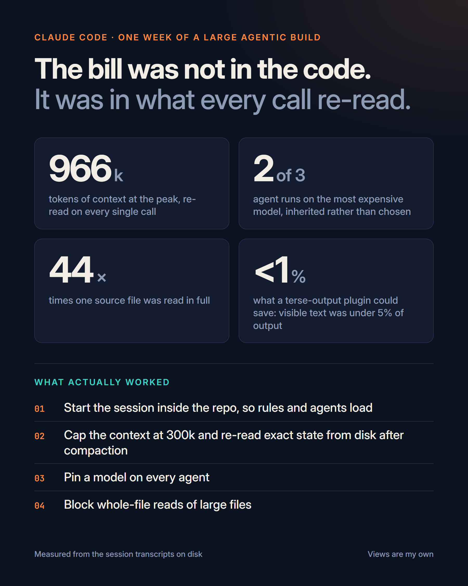

<p align="center">
  
</p>

# receipts

**Claude Code keeps the receipts. Read them before you buy a plugin.**

Every Claude Code session is already logged on your disk, call by call, with the exact token counts, the model that answered, every tool call and every tool result. `receipts` reads those files and tells you, with numbers, where your usage actually went. Then it fixes the things that move the number.

```text
/plugin marketplace add mdmudassirahmed/receipts
/plugin install receipts@receipts
/receipts
```

Standard library Python, nothing leaves your machine, nothing is committed or deleted.

## The story behind it

One week of a large agentic build: one lead session, a dozen subagents, all day. Usage climbed every day. The popular advice was to shrink the output, with a terse-talking plugin or a code knowledge graph. Reading the transcripts instead gave a different picture.

| What the receipts said | Number |
|---|---|
| Context at the peak, re-read on every single call | 966k tokens |
| Calls above 300k context | 29% |
| Re-read tokens a 300k cap would have avoided | 27% of all of them |
| Agent runs that silently inherited the most expensive model | 2 of 3 |
| Sessions started one folder above the repo, so CLAUDE.md and the pinned agents never loaded | 9 of 10 |
| One source file read in full | 44 times |
| Share of output tokens that was visible text (the only thing a terse plugin can shrink) | under 5% |

The spend was not in reading code and not in the model's prose. It was in re-reading the conversation, on a model nobody chose, from a folder that threw away the config. All three are structural, and all three are fixable in an afternoon.

## Why not caveman or graphify?

Both are good tools for what they do. Neither touches the part of the bill that is usually largest.

| | caveman | graphify | receipts |
|---|---|---|---|
| What it changes | How the model talks | How the model reads code | How much context each call re-reads, which model answers, whether your config loads |
| Where the saving comes from | Output tokens | Input tokens for code lookups | Cache-read tokens (the bulk of an agentic session) and model price |
| Ceiling in the case above | about 1% (visible text was under 5% of output) | near 0% (code reads were a small slice of input, and it had never indexed the repo) | about half the spend, pending the measured week |
| Tells you before you install it | no | no | yes, that is the point |
| Measures the result afterwards | no | no | `--compare` a week later |

`receipts` is not a replacement for either. Run it first. If the report says your output tokens dominate, caveman will help and the report will say so. If repeated code reads dominate, a code index will help. In most multi-agent sessions, they do not.

## What the report shows

```text
/receipts                          every project on this machine
/receipts --project <path>         one project (the cwd you start Claude from)
/receipts --since 7                last 7 days only
/receipts --json before.json       save a snapshot
/receipts --compare before.json    before and after table
```

1. **Totals.** Tokens by kind, split into lead sessions and subagents, with an API-dollar equivalent as a relative proxy for plan usage.
2. **Context per call** in 100k buckets, and how many re-read tokens a cap at 200k, 300k, 400k or 500k would have avoided.
3. **Model mix**, and which transcripts each model dominated.
4. **Agent dispatch.** Subagent type and the model it was given. "inherited" means no model was pinned, so it ran on the parent's model.
5. **Where sessions started**, and whether a CLAUDE.md and a `.claude/agents` folder exist there. Claude Code only loads them from the session folder and its parents. One folder too high and both are silently gone.
6. **Tool results by size**, and files read whole three or more times.
7. **The most expensive transcripts**, with their first prompt.
8. **Recommendations** generated from the numbers above, each with the measured basis next to it.

## The fixes

```text
/receipts apply [--cap 300000]     global: ~/.claude/settings.json, backup first, --dry-run first
/receipts scaffold <repo>          repo side: CLAUDE.md rules, post-compaction hook, agent model check
```

| Fix | What it does | Why it is safe |
|---|---|---|
| Context cap | `CLAUDE_CODE_AUTO_COMPACT_WINDOW` so compaction happens at 300k instead of 1M | A SessionStart `compact` hook re-injects exact state from disk (task tracker, newest hand-off section, last commit, git status), so facts come from files, not from the summary |
| Read guard | PreToolUse hook that denies a whole-file `Read` of a text file above 40 KB and asks for `offset`/`limit` or Grep | Images, PDFs and notebooks are exempt; the limit is `READ_GUARD_MAX_BYTES` |
| Tiered agents | Lists every agent in `.claude/agents` without a `model:` line, with a suggested tier table | You choose the models; it only reports |
| Token discipline | A CLAUDE.md section: start in the repo, named agents only, spec files, bounded tasks, logs to files, 300-word hand-backs | Plain rules the model follows; remove the section to undo |
| Session retention | `cleanupPeriodDays` raised to 30 if it was under 7 | Your receipts stop being deleted after a day |

`apply` writes a timestamped backup of `settings.json` and prints before and after. New sessions pick it up; running sessions keep their startup values. `scaffold` never commits; review with `git status`.

## Install without the plugin system

```bash
git clone https://github.com/mdmudassirahmed/receipts
cp -r receipts/skills/receipts ~/.claude/skills/
```

Then `/receipts` in any Claude Code session, or run the scripts directly:

```bash
python ~/.claude/skills/receipts/scripts/audit.py --since 7
python ~/.claude/skills/receipts/scripts/apply.py --dry-run
python ~/.claude/skills/receipts/scripts/apply.py scaffold /path/to/repo
```

Python 3.8 or newer, standard library only. Windows, macOS and Linux.

## Measuring the result

Day one, from the repo folder:

```bash
python ~/.claude/skills/receipts/scripts/audit.py --json before.json
```

A week later:

```bash
python ~/.claude/skills/receipts/scripts/audit.py --since 7 --compare before.json
```

You get a before and after table: spend, average context per call, share of calls over 300k, share of agent runs with an inherited model, share of calls on each model tier. Post the table, not the promise.

## What it will not do

No network calls. No git commits. No deletions. No edits outside `~/.claude` and the repo you name. Dollar figures are API list prices used as a relative proxy, because subscription plans meter differently; the ratios are what matter.

## How it works

Claude Code writes `~/.claude/projects/<encoded-cwd>/<session>.jsonl`, one JSON record per message, and subagent runs in subfolders. Each assistant record carries `usage` with `input_tokens`, `cache_creation_input_tokens`, `cache_read_input_tokens` and `output_tokens`, plus the model id. Tool calls and tool results are in the message content. `audit.py` walks every file, sums per call, buckets the context size, matches tool results to their calls, and checks each session's `cwd` against the files on disk. Nothing else is needed.

## Licence

MIT.
