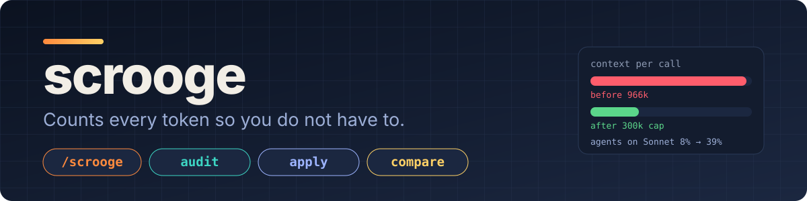
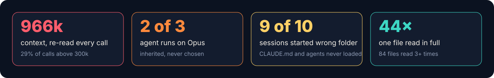
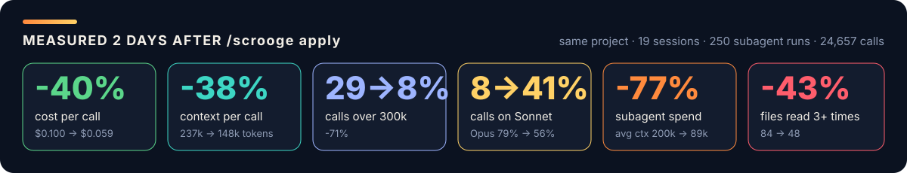

<p align="center">
  
</p>

<p align="center">
  <a href="https://github.com/mdmudassirahmed/scrooge/blob/main/LICENSE"></a>
  
  
  
  
  <a href="https://github.com/mdmudassirahmed/scrooge/stargazers"></a>
</p>

# 🧾 scrooge

**Counts every token so you do not have to.**

Claude Code writes down every call you make: the context size, the model, every tool result. scrooge reads that ledger and tells you where the money went. Then it fixes the things that actually move the bill. Nothing leaves your machine.

---

## 🔍 What It Does

Reads `~/.claude/projects/**/*.jsonl`, the transcripts Claude Code already keeps. Adds up the tokens per call. Finds the four leaks that terse-mode plugins cannot see:

- **Context that never shrinks.** Every call re-reads the whole conversation. At 900k that is the bill.
- **Agents on the wrong model.** No `model:` pinned, so every subagent inherits Opus. Nobody chose that.
- **Config that never loaded.** Session started one folder above the repo. CLAUDE.md and your agents silently ignored.
- **Files read over and over.** The same 145 KB file, 44 times.

<p align="center"></p>

Then it caps the context with a hook that restores exact state from disk after compaction, blocks whole-file reads of big files, lists the agents with no model, and measures the result a week later.

---

## ⚡ Install

```text
/plugin marketplace add mdmudassirahmed/scrooge
/plugin install scrooge@scrooge
```

Or copy one folder:

```bash
git clone https://github.com/mdmudassirahmed/scrooge
cp -r scrooge/skills/scrooge ~/.claude/skills/
```

Python 3.8+, standard library only. Windows, macOS, Linux.

---

## 🗣️ Trigger Phrases

- `/scrooge`
- `where are my tokens going`
- `why is my usage so high`
- `cut my Claude Code cost`
- `audit my sessions`

---

## 🧰 Commands

| Command | What happens |
|---|---|
| `/scrooge` | Report for every project on this machine |
| `/scrooge --project <path>` | One project (the folder you start Claude from) |
| `/scrooge --since 7` | Last 7 days only |
| `/scrooge --json before.json` | Save a snapshot |
| `/scrooge --compare before.json` | Before and after table |
| `/scrooge apply` | Global fixes. Dry run first, backup, then write |
| `/scrooge scaffold <repo>` | Repo side: CLAUDE.md rules, post-compaction hook, agent model check |

---

## 📊 Quick Example

One week, one lead session, a dozen subagents. This is what scrooge said:

```text
avg context per call        443,000 tokens     (lead session)
calls above 300k            29%                a 300k cap avoids 27% of all re-reads
agent dispatches            219 of 331         inherited the parent model (Opus / Fable)
sessions started in         C:\Users\Hp        9 of 10   CLAUDE.md: no   .claude/agents: no
files read 3+ times         84                 pipeline.ts read whole 44 times
visible text                < 5% of output     a terse plugin tops out near 1%

1. Cap the auto-compact window at 300k and re-inject state from disk after compaction.
2. Pin model: in .claude/agents frontmatter; pass model in Workflow agent() calls.
3. Start sessions inside the repo. Nine of ten could not load the project config.
4. Install the read guard; split files over 60 KB.
```

Two days after applying it, same project, measured by `/scrooge --since 2 --compare before.json`:

<p align="center"></p>

**Same work, 40% cheaper per call: context per call -38%, calls over 300k 29%→8%, Sonnet share 8%→41%, subagent spend -77%, repeated file reads -43%.**


| | before | after |
|---|---|---|
| avg context per call | 237k | 148k |
| calls over 300k | 29% | 8% |
| calls on Sonnet | 8% | 41% |
| agent runs with inherited model | 66% | 48% |
| files read 3+ times | 84 | 48 |
| API-$ per call | 0.100 | 0.059 |

---

## 🪨 Why Not Caveman or Graphify

Both are good. Both work on a slice scrooge measures first.

| | shrinks | ceiling in the case above |
|---|---|---|
| caveman | output tokens (how the model talks) | ~1% (visible text was under 5% of output) |
| graphify | input tokens for code lookups | ~0% (code reads were a small slice; it had never indexed the repo) |
| scrooge | cache-read tokens, model price, config that never loaded | about half the spend |

Run scrooge first. If it says your output tokens dominate, install caveman and it will tell you so. In most multi-agent sessions it will not.

---

## 🔧 The Fixes

| Fix | What | Undo |
|---|---|---|
| Context cap | `CLAUDE_CODE_AUTO_COMPACT_WINDOW=300000` plus a `SessionStart` compact hook that prints tracker, newest hand-off section and git state from disk | delete the env line |
| Read guard | PreToolUse hook. Whole-file `Read` over 40 KB denied, asks for `offset`/`limit` or Grep. Images and PDFs exempt | remove the hook entry |
| Tiered agents | Lists every `.claude/agents` file without `model:`, with a suggested tier table. You choose | nothing to undo |
| Token discipline | A CLAUDE.md section: start in the repo, named agents only, spec files, bounded tasks, logs to files, 300-word hand-backs | delete the section |
| Retention | `cleanupPeriodDays` to 30 if it was under 7, so your ledger stops vanishing | restore the backup |

`apply` backs up `settings.json` with a timestamp and prints before and after. New sessions pick it up. `scaffold` never commits.

---

## 🚧 Boundaries

- No network. No git commits. No deletions. No edits outside `~/.claude` and the repo you name.
- Dollar figures are API list prices used as a relative proxy. Plans meter differently; the ratios are what matter.
- Worktree clean-up and model choices are reported, never performed.

---

## 📁 Files

`skills/scrooge/SKILL.md` loaded by Claude at runtime. `scripts/audit.py` the report. `scripts/apply.py` the fixes. `scripts/read_guard.py` the hook. `templates/` the post-compaction hook, CLAUDE.md section and agent tier table that `scaffold` installs.

MIT.
